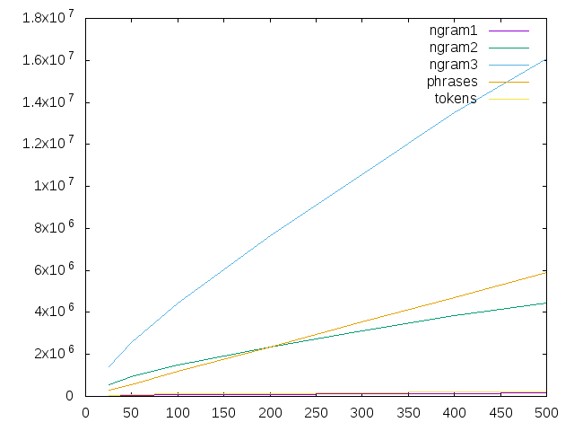

Natural Language Processing Tools (NLPT)
==========================================
NLPT is a set of tools intended to learn for a text corpora how to recognize and synthesize a text on a natural language. The final point of development is supposed to be a productive game for a few persons, including an artificial one, that leads to a composing of a text by means of collaborative work of participants. During the game an artificial intelligent leads a team of collaborators, prompting keywords for a possible continuation, evaluating the writings of participants and might even producing its own phrases.
 
The idea of an algorithm are based on statistical analyses of text and simple machine learning techniques.
 
The Game Script
--------------------

  1. Introduction part:
  
    1. Participants choose a topic a few phrases;
  
    2. An AI suggests a few keywords to clarify the topic;
    
    3. Participants vote for the keywords;
    
    4. The AI sets up elected keywords to be used in the text.
    
  2. Main part:
    
    1. The AI offers a few words to write a phrase;
    
    2. Participants are writing a phrase that contains a few of the offered words;
    
    3. The AI evalutes how good the phrases are and exposes an evaluation mark (as a number from 0 to 10);
     
    4. The AI might produce it's own phrase;
    
    5. Participants are voting for the phrases;
    
    6. The elected phrase becomes a continuation of the text above;
    
    7. Game continues from the step 2.1.
    
  3. Additional services:
      
    1. The AI can suggest to change a phrase a bit (add more words, change a word to a synonym or something like that);
       
    2. The AI can sugest synonyms for a word;
       
    3. The AI can feel a gap in a phrase (for example, if a participant have no idea which word to use there);
       
    4. The AI can synthesize a phrase from a set of words;
       
    5. The AI can suggest a few related words.
       
    6. Show pictures that can ilustrate a phrase, a word, or an idea;
    
  4. Social services:
    
    Actualy, some social services have to be provided for the sake of teambuilding, but this idea is out of scope of this very project.
     
  5. Autonomous work:
       
    For the lack of collaborators during a development phase, and especially because necesserity to check a lot of approaches the first few releases are going to be providing only autonomous services, that can resolve all of the challenges the game script needs without arranging them into the script.   
  

The componenents
------------------
Gathering statistic from a text corpora includes tokenizing a text stream, gathering phrases from the stream of tokens, counting simple statistics from the phrases, saving statistic, phrases, and everything in a storage.

Below I provide a simplified description for the algorithms that I suppose to use developing this components.

### Tokenizer
Tokenizer splits text to tokens, actually, in some places it can provide a few variants of a token (for example, the dot can be an end of phrase or the end of a shortcut). Thats why tokenizer provides stream of the sets of the tokens for each position in the text.

### Phrase buffer

Phrase buffer accumulates stream of the tokens and applies a phrase detector for the current content. Each time the detector assures the buffer contains the whole sentense, the sentece is raised into the output stream wiping of the buffer. 

### Phrase detector
Phrase detector checks for a sequence of token variants if the begining of the sequence contains a whole phrase. The main approach is to use 2- 3- gramms statistic to build the most probable way thru the bufer of tokens looking for more probable one. If it passes thru the dot-as-end-of-phrase (DAEP) it suggests it has found a whole sentence. The main problem there is that actually tokenizer never knows which dot it has, and if the word is a begining of a phrase (escpecially for German language). Also, the text can contain some mistyping. 

### Phrase evaluator
Phrase evaluator counts the probability of a phrase from the set of tokens it contains.

### 2 Gramm and 3 gramm counter
2-gramm and 3-gramm counter is just 
a map of n-gramms to the probabilities. Just because of tremendous amount of n-grams, it works in a memory but can incrementally save statistic in a storage.

### Storage
Storage contains:
  
  1. All of the tokens (as id) and words they reperesent;
   
  2. Probabilities of 2-gramms and 3-gramms;
  
  3. The original phrases;
  
  4. The histogramms of the words (or phrases) for each of the samples (to avoid possible duplication of samples);

Usage
-----
The initial release only contains a few console applications those can gather statistic from a text corpora, save it into the storage and provide simple services from a command prompt. 

To collect statistic,  issue:

    `sbt "run-main com.github.dronegator.nlp.main.NLPTMainStream <FILE WITH A TEXT CORPUS> <FILE OF STORAGE>`
  
  or 

    `sbt "run-main com.github.dronegator.nlp.main.NLPTMain <FILE WITH A TEXT CORPUS> <FILE OF STORAGE>`
  
The applications do the same, except the first one uses AKKA-STREAMS that helps to require less RAM.

You might have to index text twice, using the previous result as an innitial hint. It provides a possibility to take into consideration meaningful words building the correlation matrix for suggestions:

    `sbt "run-main com.github.dronegator.nlp.main.NLPTMain <FILE WITH A TEXT CORPUS> <FILE OF STORAGE> <FILE OF STORAGE WITH HINTS>`

To use collected statistic, issue:   

    `sbt "run-main com.github.dronegator.nlp.main.NLPTReplMain <FILE OF STORAGE>`
    
  * probability [Word]+ 
  
    Evaluates a probability of a phrase:

        > probability He was reading a book .
        probability = 0.00000010187081
        length = 9
        tokens = 1 :: 1 :: 1494 :: 1047 :: 495 :: 43 :: 670 :: 4 :: 2 :: Nil

  * [Word]+
  
    Suggest a few words to continue the phrase:
    
        > He was reading a
        Possible continuation of the phrase: 
         - copy, p = 0.028846153846153848
         - magazine, p = 0.057692307692307696
         - newspaper, p = 0.1346153846153846
         - book, p = 0.36538461538461536

  * [Word]+ .
    
    Suggest a few words for the next phrase:
    
        > He was reading a book .
        We suggest a few words for the next phrase:
        - author, p = 0.047337278106508875
        - house, p = 0.047379948229278435
        - spot, p = 0.048306960043421984
        - hands, p = 0.051535244106211735
        - time, p = 0.056087109390086945
        - room, p = 0.061708620783714446
        - way, p = 0.09326267301371145

  * expand [Word]+
    
    Suggest a few words to use with the given ones:
    
        > expand death cause
        We suggest to expande the phrase with a few words:
         - manner, p = 0.16666666666666666
         - mistake, p = 0.16666666666666666
         - box, p = 0.16666666666666666
         - sense, p = 0.16666666666666666
         - children, p = 0.2
         - son, p = 0.2
         - place, p = 0.2
         - wife, p = 0.2
     
  * generate [Word]+
    Generates a phrase containing the sequence of words:
    
        > generate reading a book
        She was reading a book of famous people .
      
  * keywords [Word]+
    Select meaninful words from a phrase:
    
        > keywords My cat was drinking a milk.
        a                    -1.000 (0.000-1.000)
        drinking             -0.275 (0.000-0.276)
        was                  0.000 (0.000-0.000)
        milk                 0.088 (0.097-0.008)
        cat                  0.114 (0.117-0.003)

   * advice [Word]+ [<Switches>]
   
      where possible switches are:
      
      * --keywords=[Word:]+ - obligatory keywords for the phrase variations;
        
      * --use-best - show only phrases those seem to be better than provided one;
         
      * --limit=<NUMBER> - maximum amout of changes in a phrase;
        
      * --use-auxiliary - allow variations for auxiliary words only. 
       
      Suggest possible substitution of the words in a phrase (the intentional error has provided for the illustration puprpose):
       
          > advice He were reading a book . 
          0.3902 They were reading a book .
          0.3532 There were reading a book .
          0.6429 He was reading a book .
          0.0714 He remembered reading a book .
          0.1667 He were in a book .
          0.0549 He were on a book .
          0.0363 He were reading a little .
          0.0140 He were reading a moment .
          0.0102 He were reading a while .
          0.0101 He were reading a lot .

      A few [advanced examples of advices](doc/HowToCheckTheGrammarStructure.md)        

  The storage has to be converted to the dictionary for an android application (but the feature has not implemented yet).

The outcome
-----------
[Script for V0.1 85MB corpora](doc/example/Script01.md)

[Script for V0.3 200MB corpora](doc/example/Script03.md)

It can suggest the right grammar structure even for a completely distorted phrase:

    > advice I home left see  sky . --use-auxiliary
    0.00000000000000 0.00000084746385 I left my home to see the sky .
    0.00000000000000 0.00000273394864 I left home to see the sky above .
    0.00000000000000 0.00000347182913 I left her home to see the sky .
    0.00000000000000 0.00000373906493 I left his home to see the sky .
    0.00000000000009 0.00002584272971 I left home to see the sky .

Statistic:

 For a text corpora of different size I get the vocabulary with following statistic:
 
     size    ngram1  ngram2   ngram3    phrases tokens
     25MB    43579   562136  1418363     304008  57561
     50MB    63518   958284  2584285     572440  87290
    100MB    80046  1488376  4426209    1176200 110011
    200MB   103401  2342440  7640428    2359260 144527
    300MB   124285  3101673 10575922    3542017 178109
    400MB   144823  3849867 13499864    4709330 211151
    500MB   157112  4443462 16063365    5901462 230416
    
    
     

History
---------
[Version 0.0](https://github.com/dronegator/nlp/tree/v.0.0), 20160814, Initial release of nothing.

[Version 0.1](https://github.com/dronegator/nlp/tree/v.0.1), 20160825, Prototype the index tools and functions to cover the simplified script of the game.

[Version 0.2](https://github.com/dronegator/nlp/tree/v.0.2), 20160831, Improve inner architecture and packaging.

[Version 0.3](https://github.com/dronegator/nlp/tree/v.0.3), 20160911, Improve toolkit for advices

  * Discriminate auxiliary and meaningful words in a phrase;
  
  * Suggest words for the next phrase focusing on meaningful words only;
   
  * Suggest words for the same phrase focusing on meaningful words only;
  
  * Make advices how to improve a phrase looking for the best path, closest to a phrase;
    
  * Make advices only for auxiliary words, or except keywords;

The current achievments
---------------------------
