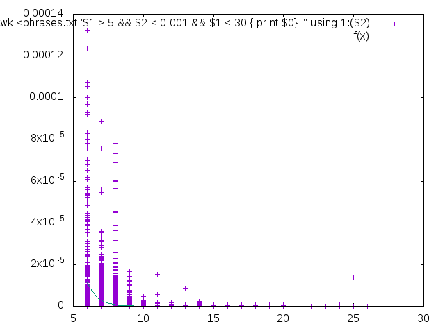
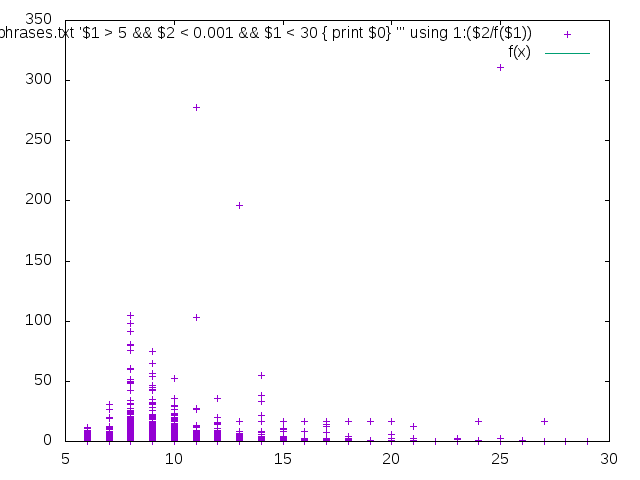

How to check the grammar structure
=====================================
The idea of an algorithm is to apply a set of possible changes, such as insertion, deletion, substitution, or reversing the order.  Then, the algorithm evaluates probabilities of a generated variety of the phrases, inspired by the initial one by means of a matrix of conditional probabilities (as in Markov chain).  Making recursive descend along the phrase an algorithm can vary the phrase quite effectively, filtering out most probable variants.

One can select a class of words which can be subjected to changes (auxiliary or meaningful ones), that leads to the different outcomes:  variation of auxiliary words leads to restoring of the grammar structure even for severe mistakes, but variation all of the possible words gives an inspiration of changing the whole sense of the phrase.

Resulting phrases have to be sorted by their probabilities. Obviously, the long phrases seem to be less probable than short ones, that's why we have to equalize probabilities with respect to the average probability of phrase of different size. Just for your information,
for the 200MB text corpus the dependency is presented on a figure bellow:

        *original probabilities*
    
    
        *equalized probabilities*

A few examples follow.

Let assume a language learner tries to build a simple phrase about him and his job. He is writing something like:
 
    > advice  I come at my office to earn some money .
        0.00000000004017 0.01147911538841 If I wanted to earn some money .
        0.00000000004287 0.01225118772402 But I have to earn some money .
        0.00000000004344 0.01241403582875 I wanted him to earn some money .
        0.00000000012818 0.01248468912342 You had to earn some money .
        0.00000000000503 0.01256404482244 I was in order to earn some money .
        0.00000000004912 0.01403563495559 We were going to earn some money .
        0.00000000000601 0.01499660756620 You should be able to earn some money .
        0.00000000000681 0.01699058637141 When I was able to earn some money .
        0.00000000020637 0.02010100780780 We need to earn some money .
        0.00000000000985 0.02459619205275 And I was going to earn some money .
        0.00000000028311 0.02757529158797 We had to earn some money .
        0.00000000001329 0.03317834801200 When I was going to earn some money .
        0.00000000037169 0.03620305387295 In order to earn some money .
        0.00000000014870 0.04249132528485 I was trying to earn some money .
        0.00000000016097 0.04599911185698 I had nothing to earn some money .
        0.00000000098466 0.09590607729101 I want to earn some money .
        0.00000000049842 0.14242831317467 I was going to earn some money .
        0.00000001346181 0.20706804377405 I would earn some money .
        
The first column here shows evaluated probability of a phrase (and it is quite low for long phrases), then the second one shows equalized probabilities.        

That looks impressive, but she actually wants to stick the idea of office, so she issues the following query:  

    > advice  I come at my office to earn some money .  --keywords=come:money:earn:office 
        0.00000000000000 0.00000007886548 I could come to the office, to earn some money .
        0.00000000000000 0.00000008915299 I had come to my office , to earn some money .
        0.00000000000000 0.00000010098591 I will come to his office trying to earn some money .
        0.00000000000000 0.00000010230600 I had come to the post office trying to earn some money .
        0.00000000000000 0.00000011385179 I had come into the office , to earn some money .
        0.00000000000000 0.00000011569398 I had come to her office , to earn some money .
        0.00000000000000 0.00000011916062 When I come to his office trying to earn some money .
        0.00000000000000 0.00000012057044 I had come to his office , to earn some money .
        0.00000000000000 0.00000013099221 I have come to his office trying to earn some money .
        0.00000000000000 0.00000013962438 When I come into his office trying to earn some money .
        0.00000000000000 0.00000023130864 I had come to the office , to earn some money .
        0.00000000000000 0.00000032474883 I had come into his office trying to earn some money .
        0.00000000000000 0.00000049788499 I had come to his office trying to earn some money .

That gives a few ideas of different tense and word usage to express approximately the same. The current prototype fails to consider the possibility of an impossible combination of words in the same phrase, so it could have suggested something like "some apples", but we were happy in the example above.
  
But what if a learner failed to find a suitable grammar structure? Even in the case of substantial mistakes with articles and the other auxiliary words,  the algorithm can suggest a suitable phrase:  
 
    > advice  I  come  his office for trying  earn money .  --use-auxiliary
        0.00000000000000 0.00000013099221 I have come to his office trying to earn some money .
        0.00000000000000 0.00000049788499 I had come to his office trying to earn some money .

Actually, one can just query a possible phrase for keywords:

    > advice come his office trying earn money .  --use-auxiliary
        0.00000000000000 0.00000000000000 come on his office trying to earn .
        0.00000000000000 0.00000000047361 come on his office trying to earn some money .
        0.00000000000000 0.00000000049424 I come on his office trying to earn some money .
        0.00000000000000 0.00000003408667 I come to his office trying to earn some money .
    
The suggested algorithm can help sometimes, but actually, it is more about a generation of a phrase from keywords, that is going to be provided by a similar but separate approach.

Another point is about rare usage of not so intuitive expressions, as the usage "I were" in a subjunctive, so if one is interested in possible usage "I were" they can issue:
 
    > advice I were at office . --keywords=office:were:I
        0.00000000000122 0.00034895504626 But I were standing at the office .
        0.00000000000015 0.00037576452463 If I were standing at the office window .
        0.00000000000158 0.00045030648316 If I were seated at his office .
        0.00000000000555 0.00054058049967 But I were at the office .
        0.00000000000815 0.00079353653813 If I were at my office .
        0.00000000002920 0.00834518062934 If I were standing at the office .
        0.00000000013273 0.01292785979987 If I were at the office .

    > advice I were .  --keywords=were:I
        0.00000000131776 0.00170649906096 But I were gone .
        0.00000000207947 0.00269290986974 But I were together .
        0.00000000350560 0.00453975679086 But I were there .
        0.00000000387607 0.00501950324775 But I were doing .
        0.00000001696408 0.01361073653835 But I were .
        0.00000003151394 0.04081053723215 If I were gone .
        0.00000004973000 0.06440032755711 If I were together .
        0.00000008383574 0.10856725197006 If I were there .
        0.00000009269522 0.12004027946183 If I were doing .
        0.00000040569207 0.32549767120393 If I were .

So, it's possible, for a subjunctive mood.

The algorithm could not supplant the human-teacher (yet), but it can be quite helpful for a language learner to explore the possible variations of phrases, auxiliary words, and whatsoever. The can even try to set --uncertainty=-1, that makes an algorithm to be more relaxed about the grammar, but it can look as a complete delusion, so I avoided such examples here. 
